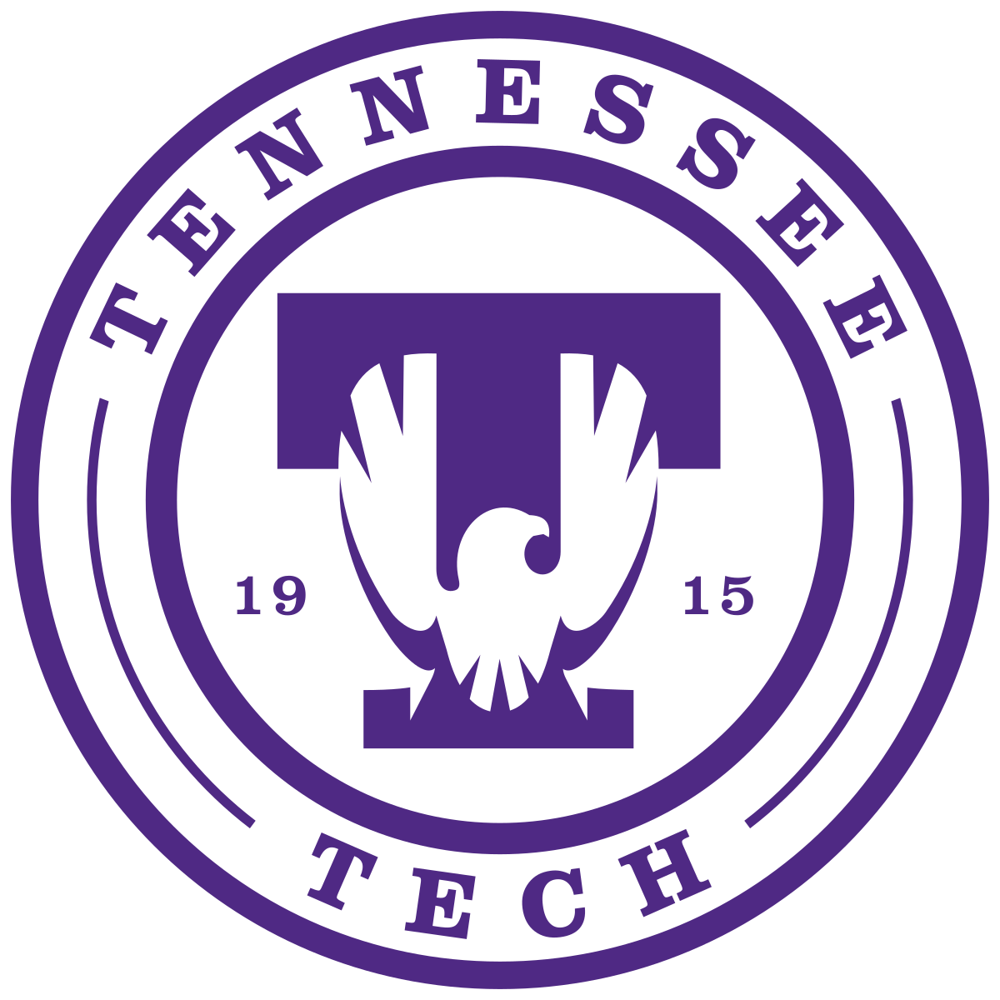

  

# Lexxeous

Profile version: *v0.0.1*

> aka:

**J** onathan  
**A** lexander  
**G** ibson  

// TODO make badges for profile version and prominent skills

I am:

  * a code monkey,
  * a Minecraft junkie,
  * a technology enthusiast,
  * a Kingdom Hearts fan, &
  * a life-long learner.

I have a BS in Computer Engineering and a MS in Computer Science from Tennessee Technological University in Cookeville, Tennessee.

// TODO school contact email etc...

**Go Eagles.**

I am fascinated by robotics, hardware design, high-performance computing, mathematical theory, & quantum physics, as such I casually study these concepts in my free time. I am interested in pursuing a career path in machine learning, data analytics, blockchain, IaC automation, and/or full stack software development.

I currently work as a Software Engineer at Paychex.

// TODO PAYX contact email etc...

I have experience with:

  * OOP:
    - C, C++, Java
  * Python:
    - AI model design & training, SciKitLearn, data-frame manipulation
  * Web Development:
    - Ruby on Rails, PHP, Angular, Node, & Django.
  * .NET:
    - C#
  * Assembly:
    - 16-bit ASIC, 64-bit Intel and AT&T.
  * Microservices:
    - Containerization, Docker, Kubernetes
  * IaC:
    - Azure ARM JSON templates, Terraform, YAML
  * Cloud Services, Architecture, & Administration:
    - GCP, Azure